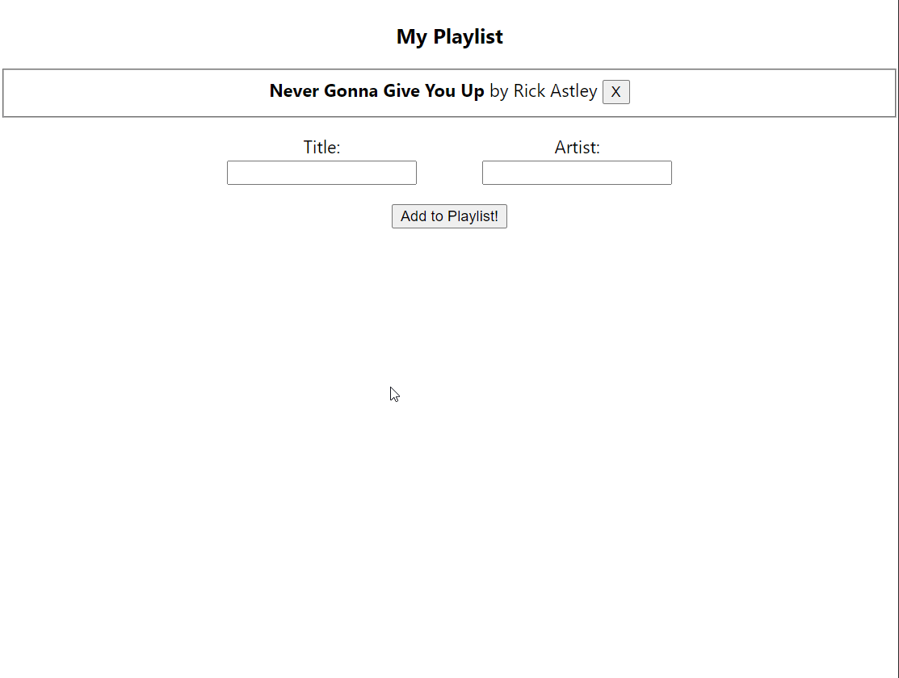

In this assignment, we finally get to work on frontend!!! You will be developing a simple songs list app which allows you to add and view songs.

## Part 1: Song component

Create a component, Song, that represents a song in your playlist.
It will be passed two props, `title` and `artist` containing some metadata about
the song.

You can test this component by importing the Song component in
App.tsx and creating a component:

```tsx title="App.tsx"
<Song title="Never Gonna Give You Up" artist="Rick Astley" />
```

Make sure to remove it once you are done testing!

## Part 2: Adding songs

Create a component, Playlist, that contains all of the songs you've added. This will do the following:

- Maintain a state containing a list of `songs`, which are objects containing the info about each song.
- Have two input fields, one for title and one for artist.
- Have a button which allows you to submit the new song and adds to the list.

Some things to remember about your implementation or **you will lose points!**:

- Create a type for your songs! Do not leave it as `any` type.
- Use your `Song` component from part 1 and pass it props instead of mapping directly into HTML elements.
- Add a [`key` prop](/docs/2021fa/lecture5#rendering-lists) when rendering lists.

## Part 3: Adding Playlist to App.tsx

Initialize your Playlist component in App.tsx. This can be done by
importing Playlist and creating a component:

```tsx title="App.tsx"
<Playlist />
```

## Part 4: Optional Challenge: Removal

Make it so that clicking a button next to a song removes it from the Playlist.

Hint: pass down callbacks (functions) into child components!

## Demo

Here is how it might look and function!
Note that the song removal part is optional but definitely give it a try :)



## Submission

Take one last look at your browser console for some errors (hint: you might need to worry about unique key props for rendering the list of songs). Submit a zip file of everything in your project directory EXCEPT `node_modules`. You will lose points for including `node_modules`.

## FAQ

### Getting a bunch of type errors and TypeScript is asking me if I want to infer types from usage.

Make sure you initialized your app properly with `yarn create react-app --template typescript`. This handles all the type packages for you, so you don't have to
manually do `yarn add @types/react -D`.

### My songs state isn't updating as expected, and is exhibiting weird behavior.

This is a common problem when starting out with React, and is likely because
you might be trying to handle state in an imperative / non-immutable way. Say we
have a state given by `const [myNumbers, setMyNumbers] = useState<number[]>([])`.
You can see that this is a state that is parametrized to store an array of numbers,
initially being set to the empty array `[]`. However, we cannot directly modify
`myNumbers`—we can only read it. Therefore, doing imperative operations like `.push()`
is illegal. Instead, you have to make a copy of the `myNumbers` array and use
`setMyNumbers` to alter it. (Hint: you can get a copy of a certain array by using
the ES6 spreading syntax `[...myNumbers]`)
