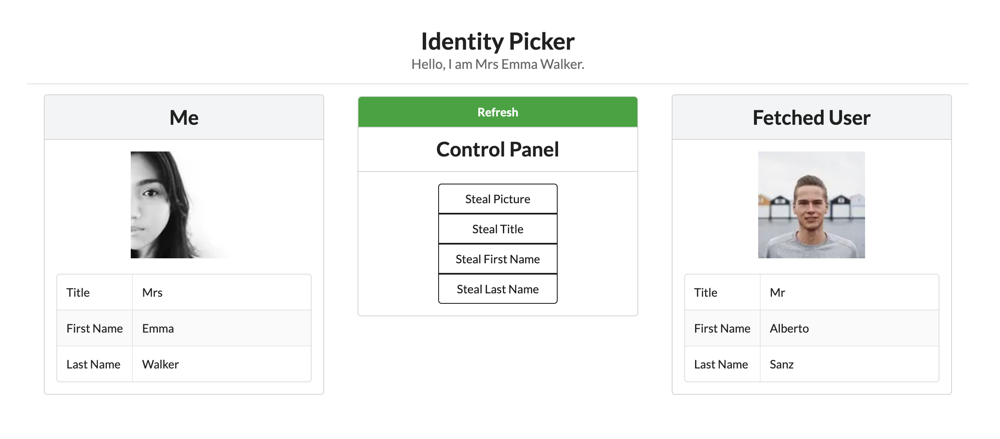

# Assignment 4: Identity Picker

**Due Oct 29 at 11:59pm**. As with all assignments, you are allowed up to 3 slip days for this assignment.

For this short assignment, you'll be fetching data from an API and using the data on the frontend. We will be ~~participating in identity fraud~~ building an identity picker, sort of like a character select screen.


Download the starter code here, and get your development environment ready.

1. Donwload the starter code.
   ```bash
   pnpm dlx degit cornell-dti/trends-mono-fa25/hw-4-starter a4
   ```
2. Open the folder in your IDE. Make sure you open the directory right above `pages`.
3. Download dependencies.
   ```bash
   pnpm install
   ```
4. Run the app locally.
   ```bash
   pnpm run dev
   ```

## Part 1: Data Fetching

To mock another person's identity, we'll be integrating a free API to mock a user's data, specifically [randomuser.me](https://randomuser.me/api).

### TODO 1

Implement the function `fetchRandomUser` in `/components/IdentityPicker.tsx`, which calls fetches data from the API and returns a `Promise<UserData>`. We defined the types `UserData` and `RandomUserAPIResponse` in `/types/index.ts` for your convenience. The API returns an array of `UserData`; you can select the first element.

_Hint_: Since this is a `GET` call, your `fetch` call does not need an additional argument. You may find `.json()` function of `Response` helpful when handling the response of the API call.

### TODO 2

Invoke this function when the page first loads and when the "Refresh" button is clicked.

_Tip_: You can see how your API request is going by opening the network tab of the console (`Cmd`/`Ctrl` + `Shift` + `C`).

_Hint_: `useEffect` is your go to hook for this one!

## Part 2: Frontend Fixes

### TODO 3

Now that the data fetching is complete, you should see two random users appear on page load. The functionality for the panel buttons in the center have not been implemented. Fix the buttons so that when they are clicked, the left user copies the respective attribute from the right user. You will have to define your own set of props.

## Submission

Please submit to CMS your `IdentityPicker.tsx` and `PanelButtons.tsx` files.
