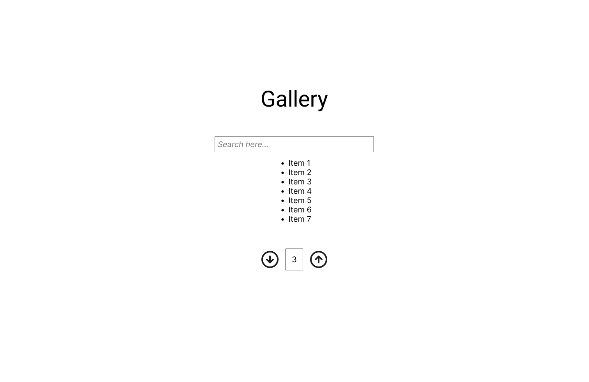

# Assignment 3: Gallery

**Due Oct 22 by 11:59pm**. As with all assignments, you are allowed up to 3 slip days for this assignment.

For this assignment, you'll be building a simple gallery app to display, filter, and paginate some data. By the end of this assignment, you should have a web app that looks like this.


Download the starter code here, and get your development environment ready.

1. Donwload the starter code.
   ```bash
   pnpm dlx degit cornell-dti/trends-mono-fa25/hw-3-starter a3
   ```
2. Open the folder in your IDE. Make sure you open the directory right above `src`.
3. Download dependencies.
   ```bash
   pnpm install
   ```
4. Run the app locally.
   ```bash
   pnpm run dev
   ```

In the source code of the assignment, you'll see some elements have the attribute `data-testid`. **Don't** delete these attributes; they are used for autograding.

## Part 1: Paginator

Like we did in class, when we build a frontend, it's good practice to build bottom up. Start with each component in the app, then combine them together to get bigger and bigger components. We'll follow this approach by first building a Paginator component. Our gallery can display a lot of items, and we can't display it all at once. Instead, we use this paginator to split them into pages.

### TODO 1

Currently, the paginator does not work. Navigate to `src/components/Paginator.tsx`. To resolve this issue, we first need to add reactive logic to the Paginator component.

Given the props that will be passed in to the client of this component, add logic to make the buttons update the page, while respecting the limits prescribed, i.e. the page displayed should always be in the range `[minLimmit, maxLimit]`. Assume as a precondition that `minLimit <= page <= maxLimit`. If `minLimit` is not defined, we assume it is 1.

_Hint_: To make a button do something on click, you need to attach a function to the `onClick` attribute of a `<button>`.

```tsx
const callback = () => {
  console.log('I was clicked');
};

return <button onClick={callback}>Click me</button>;
```

### TODO 2

The second step to fix this issue is to test it by rendering the component. In `Gallery.tsx`, render the `<Paginator>` as the last child of the outermost `<div>`, i.e. right before the last `</div>`. Pass in the proper props to the component to make the component reactive. If you implemented TODO 1 properly, your paginator should now work! You can hardcode `maxLimit` for now.

You'll notice that the state of Paginator is defined in a parent component. This is a powerful and common pattern since we need `page` to determine what data to display in `Gallery`.

_Hint_: We have defined a state `page` for you.

```tsx
const [page, setPage] = useState(1);
```

## Part 2: Gallery

Now that we have Paginator built, let's build the final Gallery. Our gallery will display `data` with at most `itemsPerPage` elements on each paginated page.

### TODO 3

To support filtering our data, we have a search bar rendered on the webpage. How do we know the contents of `<input>` to filter our data? We need to _control_ the search input. In React, a controlled input is one whose value is controlled by React state. Add some state and update `<input>`'s value to reflects the new state. When the user types into the input, the search state is updated.

_Tip_: A question you may have is how to verify that the state is being properly updated. As with any other CS class, print it out. For instance, create a button that, when clicked, logs the state. When you `console.log` anything, it appears in the console tab of your browser's dev tools. In many popular browsers, you can access the dev tools with the shortcut `Cmd`/`Ctrl`+`Shift`+`C`.

### TODO 4

With your new state from TODO 3, we can now determine what items we can display.

The `itemsToDisplay` variable should be the list of items that should be displayed on the current page according to the following rules:

- It is size-limited to the itemsPerPage prop, since we don't want to display too many items at once.
- It is filtered by the search state, so that only items whose name contains the search query are displayed. When filtering, ignore upper/lowercase, and trim whitespace from either end of the search query as well as the item name.
- It is sliced according to the current page number. For example, if we are on page 2, and `itemsPerPage` is 10, then we should display items 10-19.

### TODO 5

Up to know, we have hardcoded `maxLimit` to our Paginator. Now we can derive this value as well. Define a variable called `lastPossiblePage` that should be the last possible page number that a user can go to according to the following rules:

- It is the smallest number such that `itemsToDisplay` is non-empty.
- It is at least 1.

Pass this value into the prop `maxLimit`.

### TODO 6

Now that you have finished your `Gallery` component, let's test it out with some data. In `data.ts` we have defined a list of test data. Go into `main.tsx` and replace the props such that `data` is the list of dramas and `itemsPerPage` is some reasonable value, e.g. 10.

Congratulations! You have made a simple gallery view. Admire your creation.

## Submission

Please submit to CMS your `Paginator.tsx` and `Gallery.tsx` file.
